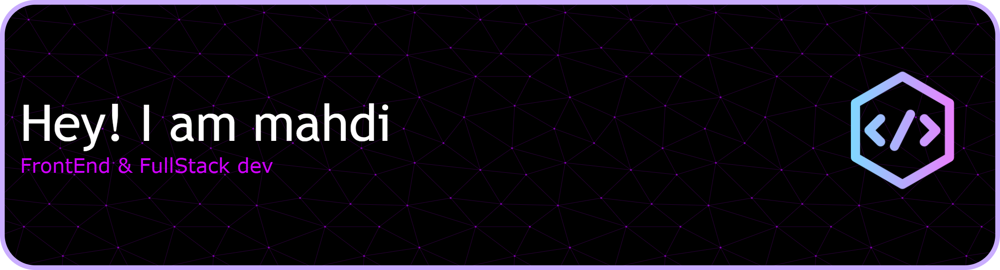

 

###

<h2>About Me 👨‍💻</h2>
Junior full-stack developer experienced in building academic web projects using React and Next.js. Strong focus on code reusability, performance, and maintainable architecture.Hands-on experience with full-stack development from database to UI.

###

<h2>Skills 😎</h2>

    

<h2>DataBase 🗃️</h2>

    

<h2>Tools ⚙️</h2>

    

###

<h2>Contact Me ✉️</h2>

&nbsp

